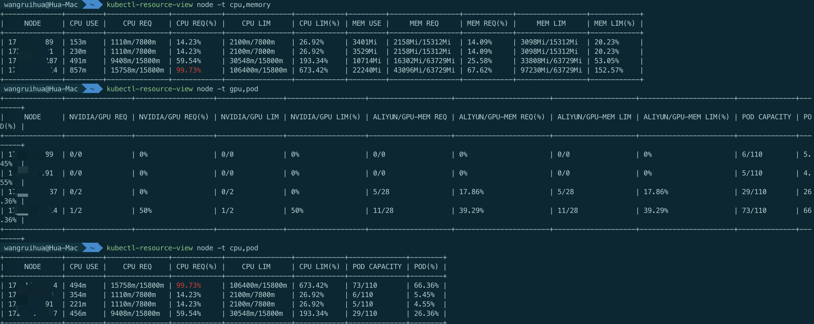
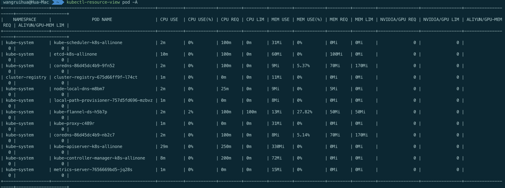
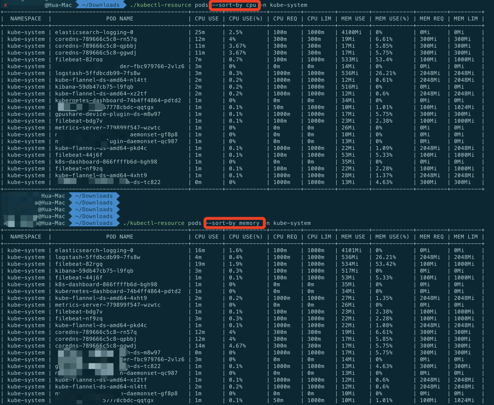
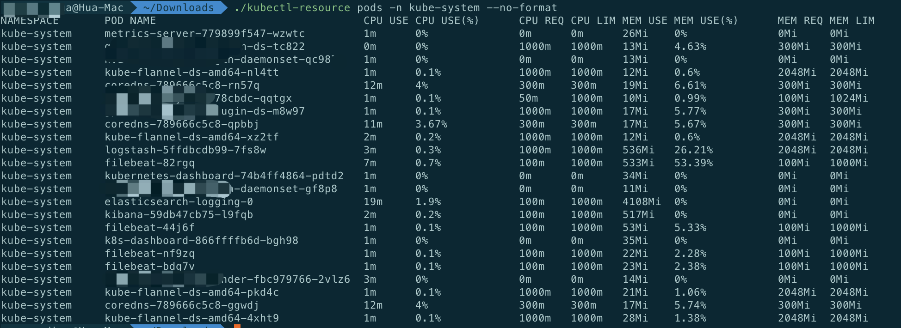

# kubectl resource
A plugin to access Kubernetes resource requests, limits, and usage.

Display Resource (CPU/Memory/PodCount) Usage and Request and Limit.

The resource command allows you to see the resource consumption for nodes or pods.

<font color="red">This command requires Metrics Server to be correctly configured and working on the server.</font>

## Installation

Use [krew](https://krew.sigs.k8s.io/) plugin manager to install:

    kubectl krew install resource
    kubectl resource --help


## Usage
```bash
$ kubectl resource -h  # or kubectl-resource -h
Display Resource (CPU/Memory/PodCount) Usage and Request and Limit.

 The resource command allows you to see the resource consumption for nodes or pods.

 This command requires Metrics Server to be correctly configured and working on the server.

Usage:
  kubectl-resource [flags] [options]
  kubectl-resource [command]

Examples:
  node        Display Resource (CPU/Memory/PodCount) usage of nodes
  pod         Display Resource (CPU/Memory)          usage of pods

Available Commands:
  completion  Generate the autocompletion script for the specified shell
  help        Help about any command
  node        Display resource (CPU/Memory/PodCount) usage of nodes
  pod         Display resource (CPU/memory) usage of pods

```
### node
```bash
$ kubectl resource node -h  # or kubectl-resource node -h
Display resource (CPU/Memory/PodCount) usage of nodes.

 The resource-node command allows you to see the resource consumption of nodes.

Usage:
  kubectl-resource node [NAME | -l label]

Aliases:
  node, nodes, no

Examples:
  # Show metrics for all nodes
  kubectl resource node
  
  # Show metrics for a given node
  kubectl resource node NODE_NAME

Flags:
  -h, --help              help for node
      --no-format         If present, print output without format table
  -l, --selector string   Selector (label query) to filter on, supports '=', '==', and '!='.(e.g. -l key1=value1,key2=value2)
      --sort-by string    If non-empty, sort nodes list using specified field. The field can be either 'cpu' or 'memory' or ''.
  -t, --type string       Type information hierarchically (default: All Type)[possible values: cpu, memory, pod]

```

### pod
``` bash
$ kubectl resource pod -h  # or kubectl-resource  pod -h
Display resource (CPU/Memory) usage of pods.

 The 'resource pod' command allows you to see the resource consumption of pods.

 Due to the metrics pipeline delay, they may be unavailable for a few minutes since pod creation.

Usage:
  kubectl-resource pod [NAME | -l label]

Aliases:
  pod, pods, po

Examples:
  # Show metrics for all pods in the default namespace
  kubectl resource pod
  
  # Show metrics for all pods in the given namespace
  kubectl resource pod --namespace=NAMESPACE
  
  # Show metrics for a given pod and its containers
  kubectl resource pod POD_NAME --containers
  
  # Show metrics for the pods defined by label name=myLabel
  kubectl resource pod -l name=myLabel

Flags:
  -A, --all-namespaces          If present, list the requested object(s) across all namespaces. Namespace in current context is ignored even if specified with --namespace.
      --field-selector string   Selector (field query) to filter on, supports '=', '==', and '!='.(e.g. --field-selector key1=value1,key2=value2). The server only supports a limited number of field queries per type.
  -h, --help                    help for pod
      --no-format               If present, print output without format table
  -l, --selector string         Selector (label query) to filter on, supports '=', '==', and '!='.(e.g. -l key1=value1,key2=value2)
      --sort-by string          If non-empty, sort pods list using specified field. The field can be either 'cpu' or 'memory'.
  -t, --type string             Type information hierarchically (default: All Type)[possible values: cpu, memory, pod]
```

## Demo

### node

Show aggregate resource requests and limits  and pods Capacity. This is the same information displayed by kubectl describe nodes but in a easier to view format.

<font color="green">When the percentage of cpu request and memory request is greater than 90, it will be marked in yellow, and if it is greater than 95, it will be marked in red</font>


Example (node):


Example (Only display one of the data of the cpu or memroy or pod):
```bash
-t  [cpu/memory/pod]
```



Example (According to cpu use or memory use sort):
```bash
--sort-by  [cpu/memory]
```


Example (Support filtering by lable or by node name):
```bash
-l   key1=value1,key2=value2
```


Example (Support similar kubectl format display):
```bash
--no-format
```


### pod

Show aggregate resource requests and limits  and pods Capacity. This is the same information displayed by kubectl describe nodes but in a easier to view format.

<font color="green">When the percentage of cpu use percent and memory use percent is greater than 90, it will be marked in yellow, and if it is greater than 95, it will be marked in red</font>

Example (pod):



Example (Only display one of the data of the cpu or memroy):
```bash
-t  [cpu/memory]
```


Example (According to cpu use or memory use sort):
```bash
--sort-by  [cpu/memory]
```



Example (Support filtering by lable or by pod name or namespace):
```bash
-l   key1=value1,key2=value2
-n   namespace name
```


Example (Support similar kubectl format display):
```bash
--no-format
```



## License

Apache 2.0. See [LICENSE](./LICENSE).

---

This is not an official Google project.
